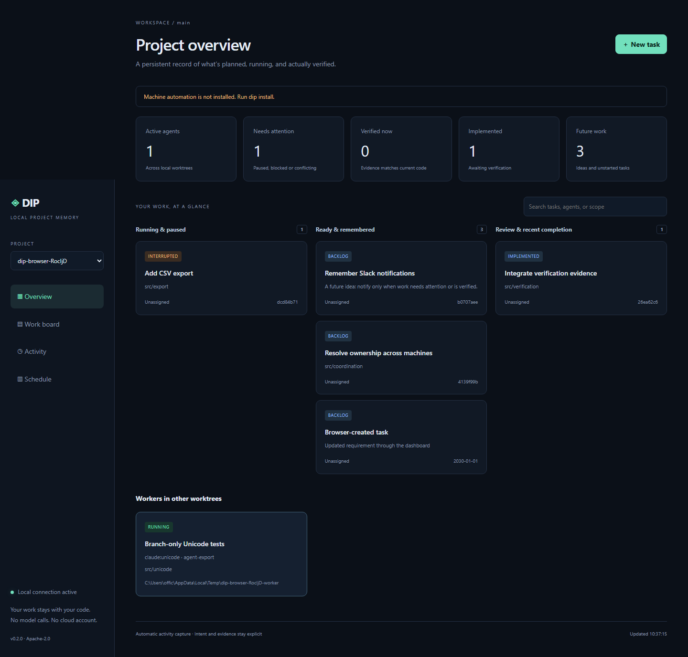

# Development Intelligence Platform

**Your session ends. Your project remembers.**

[Product overview](https://vxu.me/products/dip) · [Launch story](https://vxu.me/blog/introducing-dip) · [Find your first contribution](https://github.com/vxu-labs/dip/contribute)

**DIP** provides persistent project memory and automatic development activity for coding agents. Project data lives in **`.dip/`**.

DIP keeps plans, future ideas, checkpoints, ownership and verification evidence alongside your code. It records ordinary agent, Git and file activity automatically. Your existing coding agent handles meaningful intent; DIP makes **zero model/API calls**.

**Status:** early release, Node.js 24+, local-first. Agent hooks must be enabled and trusted in the coding tool. Worktree-family coordination is local to one machine. See [automation coverage](docs/automation.md) for exact triggers and boundaries.

## Help build the next useful handoff

DIP is early. Help a developer return to a project and understand what happened, what remains and what has actually been checked.

- **Start with documentation:** [write a reproducible single-project walkthrough](https://github.com/vxu-labs/dip/issues/1).
- **Bring your environment:** [report one real OS, shell and agent combination](https://github.com/vxu-labs/dip/issues/2).
- **Make the dashboard easier to use:** [audit one keyboard-only task flow](https://github.com/vxu-labs/dip/issues/3).

Each issue defines a concrete deliverable. Comment with your intended scope before starting, and read [CONTRIBUTING.md](CONTRIBUTING.md) for setup, isolated testing and DCO sign-off. Reproducible bug reports and documentation improvements are welcome alongside code.

## Install once

```sh
npm install -g github:vxu-labs/dip
dip install
```

The installer merges global Codex and Claude Code hooks/MCP configuration, chains existing Git hooks, initializes existing repositories under your home directory, and starts a local discovery/activity service. It adds startup entries and terminal-profile integration. Restart your coding tools and terminal and approve the hook definitions when your agent asks. It never bypasses the agent's trust settings.



New `git init` and `git clone` commands in integrated shells initialize DIP immediately, including outside watched roots. Git hooks and agent session entry initialize existing repositories on first use. Background discovery handles repositories created by other apps under monitored roots. Add external project directories or mounted drives:

```sh
dip install --roots ~/projects --roots /mnt/projects
```

Use explicit Windows paths in PowerShell, for example `--roots 'D:\Projects'`. The dashboard starts automatically at **http://127.0.0.1:4317**. It includes a project selector, work board, live activity, task details, checkpoints and evidence. Nothing is sent to a cloud service.

For a single project without machine configuration:

```sh
cd your-project
dip init
dip serve
```

## How an agent uses it

Session hooks inject a compact context with outstanding work and a stable actor/session identity. Prompts become persistent requests without an extra LLM call. Tool events and file changes are collected automatically and batched. A stopped turn saves a checkpoint; it does **not** claim the task is complete.

Use the MCP tools for meaningful transitions only:

1. `task_create` to save intent, acceptance criteria or a future idea.
2. `task_claim` to select work, declare scope and associate the hook's session/actor.
3. `task_update` for scope changes, dependencies and explicit state changes.
4. `task_checkpoint` for a handoff that explains what remains.
5. `task_verify` to execute a named, project-configured check.
6. `project_reconcile` when answering whether something actually exists now.

No manual logging per edit, no repeated plan upload, no separate model account. `project_context` is available for a compact refresh; it is not needed after every tool call. The durable format is documented in [the protocol](docs/protocol.md).

## Verification against real code

Configure named checks in `.dip/config.json`. Command arrays are executed directly, without evaluating task text as shell commands:

```json
{
  "schemaVersion": 1,
  "mode": "observe",
  "verification": {
    "unit": {
      "command": ["node", "--test"],
      "timeoutMs": 120000
    }
  }
}
```

For npm scripts on Windows, use a direct Node script or `node` with the absolute path to `npm-cli.js`; `.cmd` files are not direct executables. Review project-defined commands before running verification in an unfamiliar repository.

Evidence records the command, exit result, sanitized output and code snapshot. Code changing during a check prevents successful verification. Subsequent changes within declared scope make evidence stale. The UI separates task state, current verification and presence in the selected Git history. A passing check proves that check's outcome, not every possible product requirement.

## Git and parallel work

`.dip/` contains JSON event files, one file per immutable event. Commit this directory with the work. The Git pre-commit integration flushes and stages ledger data automatically. Commit history is the portable record; local runtime queues, leases and caches are not committed.

Independent field changes merge naturally. Competing task states produce a visible conflict even if Git's text merge succeeds. Resolve them explicitly with a task update using `resolve: true` or the dashboard. Dependency cycles are also visible.

Use separate Git worktrees for parallel agents. A shared local SQLite coordinator provides atomic ownership and scope claims, expiry and fencing tokens. Separate machines/clones require a shared coordinator to guarantee live exclusivity; ordinary Git synchronization alone cannot provide that guarantee.

Active workers appear across local worktrees even when their tasks exist only in another branch. Pass `waitMs` (up to 30000) to `task_claim` to wait locally for conflicting ownership to release in one MCP call.

## Useful commands

```sh
dip context
dip task create --title "Add CSV export later"
dip task next
dip task claim --id TASK_ID --actor codex:SESSION_ID --session SESSION_ID
dip task checkpoint --id TASK_ID --summary "Parser complete; UI remains"
dip task verify --id TASK_ID --check unit
dip reconcile
dip doctor
dip discover
dip stop
dip start
dip uninstall
```

Uninstall removes DIP's machine integrations while retaining project history and unrelated settings. Original files are backed up during installation. Installed hooks are not retroactively loaded into an already-running agent session.

## Development

```sh
npm ci
npm test
npm run check
```

Core integration tests cover persistence, merge conflicts, claims, scope exclusion, automatic capture, verification drift, installation preservation and HTTP access controls. See [contributing](CONTRIBUTING.md) and [the implementation plan](MVP_PLAN.md).

## License

[Apache-2.0](LICENSE). Commercial use and forks are permitted under its terms. Contributions use the same license and a Developer Certificate of Origin sign-off. No project trademark rights are granted by the code license.
